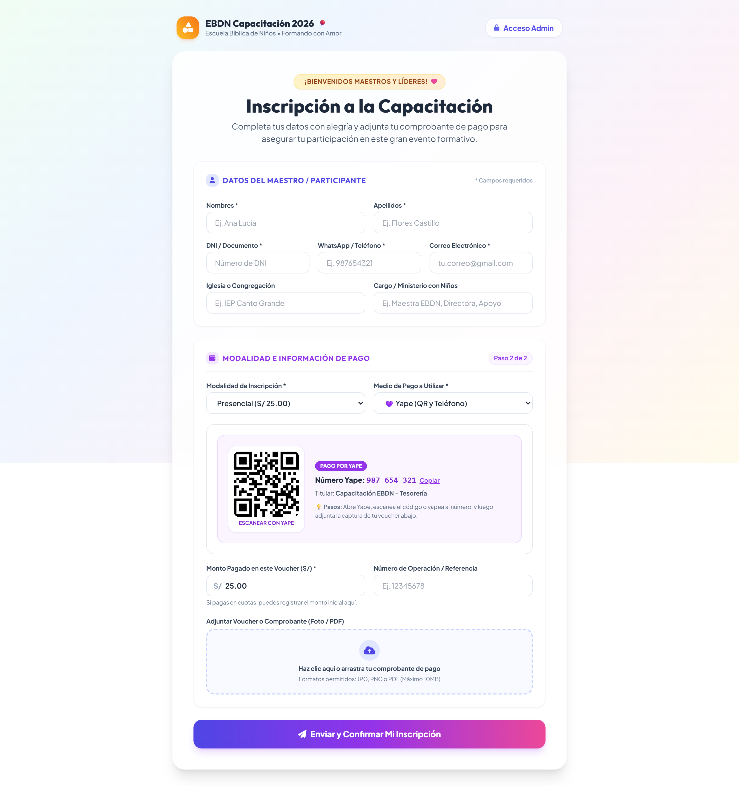
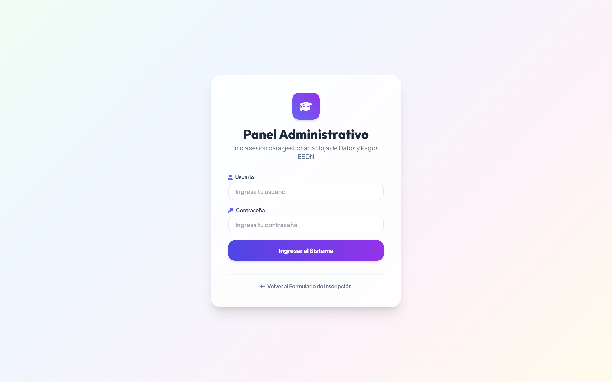
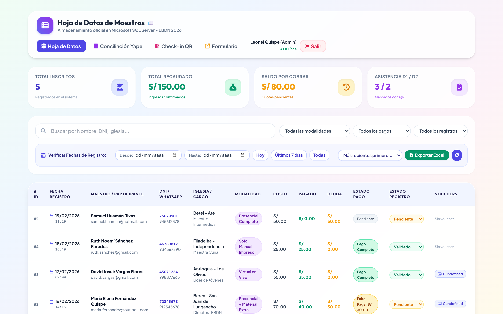
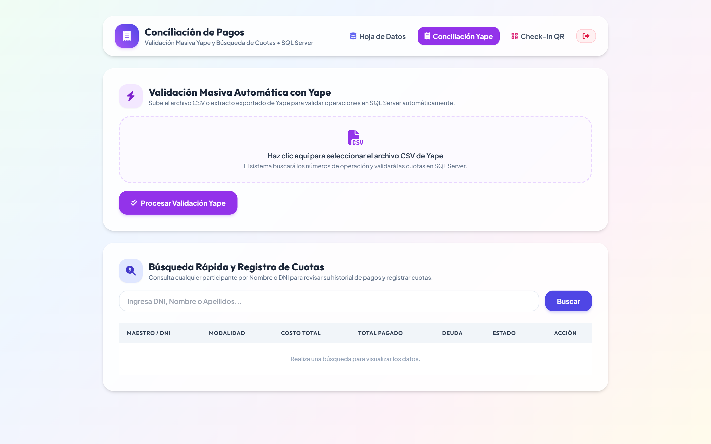
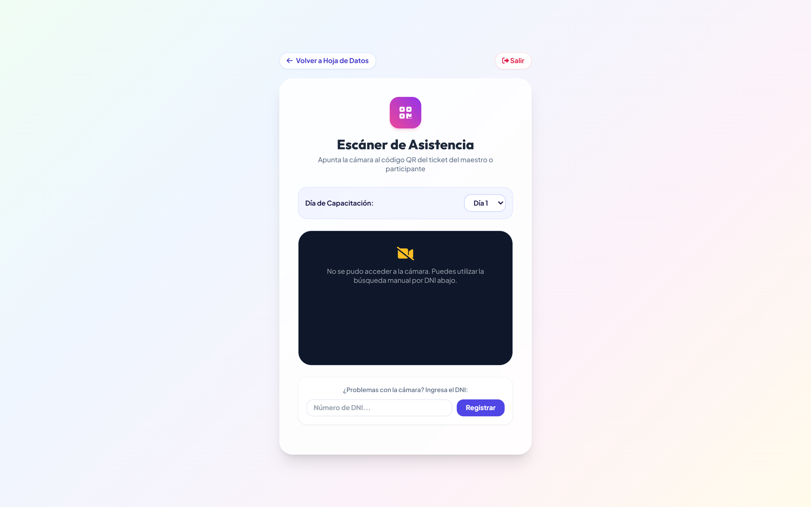

# Sistema de Capacitación EBDN 2026 (Spring Boot + SQL Server)

Proyecto web desarrollado con **Spring Boot (Java 11)**, **Spring Data JPA**, **Spring Security** y **Microsoft SQL Server**, diseñado para la gestión centralizada de participantes, cuotas de pago, control de asistencia por código QR y conciliación masiva con Yape.

Este sistema reemplaza la antigua dependencia de hojas de cálculo (Google Sheets) por una base de datos relacional robusta en SQL Server con su correspondiente **Hoja de Datos interactiva protegida**.

---

## 🚀 Arquitectura y Tecnologías
- **Backend:** Java 11, Spring Boot 2.7.18, Spring Data JPA (Hibernate), Spring Security, JWT (JSON Web Tokens).
- **Base de Datos:** Microsoft SQL Server 2022 (Instancia local `localhost:1433`, Base de datos `CapacitacionDB`).
- **Frontend:** HTML5, CSS3 (Tailwind CSS CDN + Glassmorphism), JavaScript Vanilla moderno, FontAwesome 6, Html5-QRCode.
- **Exportación:** Apache POI para generación de reportes en Excel (.xlsx) en tiempo real.

---

## 📂 Estructura del Proyecto
```text
Proyecto_Capacitacion/
├── pom.xml                               # Configuración de dependencias Maven
├── database/
│   └── script_sqlserver.sql              # Script DDL completo para SQL Server
├── src/
│   ├── main/
│   │   ├── java/com/capacitacion/ebdn/
│   │   │   ├── CapacitacionApplication.java    # Clase principal de ejecución
│   │   │   ├── config/                         # Seguridad, WebMvc y precarga de datos
│   │   │   ├── controller/                     # Endpoints REST (Auth, Public, Admin, Pagos, Checkin)
│   │   │   ├── dto/                            # Objetos de transferencia de datos
│   │   │   ├── entity/                         # Modelos JPA (Usuario, Participante, Pago)
│   │   │   ├── repository/                     # Interfaces Spring Data JPA
│   │   │   ├── security/                       # Filtro y proveedor de JWT
│   │   │   └── service/                        # Lógica de negocio y archivos
│   │   └── resources/
│   │       ├── application.properties          # Conexión SQL Server y ajustes
│   │       └── static/                         # Frontend servido directamente
│   │           ├── index.html                  # Formulario público de inscripción
│   │           ├── login.html                  # Login administrativo
│   │           ├── admin-tabla.html            # Hoja de datos (Reemplazo de Sheets)
│   │           ├── admin-pagos.html            # Conciliación masiva Yape y cuotas
│   │           ├── checkin.html                # Lector QR para asistencia
│   │           ├── css/style.css               # Estilos glassmorphism
│   │           └── js/                         # Scripts de comunicación REST
│   └── test/                                   # Pruebas unitarias e integración
└── README.md
```

---

## 🗄️ Configuración de la Base de Datos (SQL Server)
La base de datos `CapacitacionDB` y las tablas correspondientes (`usuarios`, `participantes`, `pagos`) se crean automáticamente mediante JPA o ejecutando el script:
`database/script_sqlserver.sql` en SQL Server Management Studio (SSMS).

### Parámetros de Conexión (`application.properties`):
- **Host / Servidor:** `localhost:1433`
- **Base de Datos:** `CapacitacionDB`
- **Usuario / Contraseña:** reemplaza `"Tu username"` y `"Tu pasword"` en `application.properties` por tus credenciales locales de SQL Server. No subas tus credenciales reales a este archivo al hacer commit.

### Variable de entorno requerida
Este proyecto firma los tokens de administrador con una clave JWT que **no** debe quedar escrita en el código. Antes de ejecutar, define la variable de entorno `JWT_SECRET` con un valor largo y aleatorio propio:

**Windows (PowerShell):**
```powershell
$env:JWT_SECRET="pon-aqui-una-clave-larga-y-aleatoria-tuya"
```
**Windows (CMD):**
```cmd
set JWT_SECRET=pon-aqui-una-clave-larga-y-aleatoria-tuya
```

---

## 🔐 Credenciales del Administrador
El acceso del administrador se configura de forma segura mediante **Variables de Entorno** (especialmente en Render o producción):

| Variable de Entorno | Valor por Defecto (Local) | Descripción |
|---|---|---|
| `ADMIN_USERNAME` | `admin` | Nombre de usuario del administrador |
| `ADMIN_PASSWORD` | `admin123` | Contraseña del administrador |
| `ADMIN_NAME` | `Administrador Principal` | Nombre completo visible en el panel |
| `ADMIN_EMAIL` | `admin@capacitacion.pe` | Correo del administrador |

> En producción o despliegue en Render, configura tus propias variables `ADMIN_USERNAME` y `ADMIN_PASSWORD` desde el panel de Variables de Entorno para mantener tus claves 100% privadas.

---

## 🌐 Módulos y URLs del Sistema
Una vez ejecutada la aplicación (puerto 8081):

| Módulo | URL | Acceso | Descripción |
|---|---|---|---|
| **Inscripción Pública** | `http://localhost:8081/` | Público (Cualquier persona con el link) | Formulario de registro con selección de modalidad, cálculo de monto y subida de voucher. |
| **Login Administrador** | `http://localhost:8081/login.html` | Público | Autenticación con usuario y contraseña (genera token seguro). |
| **Hoja de Datos (SQL Server)** | `http://localhost:8081/admin-tabla.html` | **Solo Administrador** | Tabla interactiva que reemplaza a Google Sheets. Permite buscar, filtrar, cambiar estados, ver comprobantes, añadir cuotas y exportar a Excel. |
| **Conciliación de Pagos** | `http://localhost:8081/admin-pagos.html` | **Solo Administrador** | Carga de CSV de Yape para validación masiva en segundos. |
| **Control de Asistencia QR** | `http://localhost:8081/checkin.html` | **Solo Administrador** | Escáner de tickets QR para registrar asistencia Día 1 / Día 2. |

---

## 🛠️ Cómo abrir y ejecutar el proyecto

### 1. Desde Terminal (Línea de Comandos)
```bash
mvn clean compile
mvn spring-boot:run
```

### 2. Desde Spring Tool Suite (STS) / Eclipse
1. Abrir Spring Tool Suite o Eclipse.
2. Ir a `File` -> `Import...` -> `Maven` -> `Existing Maven Projects`.
3. Seleccionar la carpeta `Proyecto_Capacitacion`.
4. Clic derecho en el proyecto -> `Run As` -> `Spring Boot App`.

### 3. Desde IntelliJ IDEA
1. Abrir IntelliJ IDEA.
2. `File` -> `Open...` y seleccionar la carpeta `Proyecto_Capacitacion`.
3. Esperar que IntelliJ sincronice las dependencias del `pom.xml`.
4. Ejecutar la clase `CapacitacionApplication.java`.

### 4. Desde Visual Studio Code
1. Instalar la extensión **Extension Pack for Java** y **Spring Boot Extension Pack**.
2. Abrir la carpeta `Proyecto_Capacitacion`.
3. Presionar `F5` o clic en `Run` sobre `CapacitacionApplication.java`.

---

## 📸 Capturas de pantalla

### 1. Formulario de Inscripción Pública


### 2. Login de Administrador


### 3. Hoja de Datos y Panel de Control de Participantes


### 4. Módulo de Conciliación de Pagos (Yape CSV)


### 5. Control de Asistencia y Escáner QR


## 🎥 Demo en video

_Próximamente: enlace al video de demostración del funcionamiento._

## 🌐 Demo en vivo

_Próximamente: enlace al despliegue en Render._

